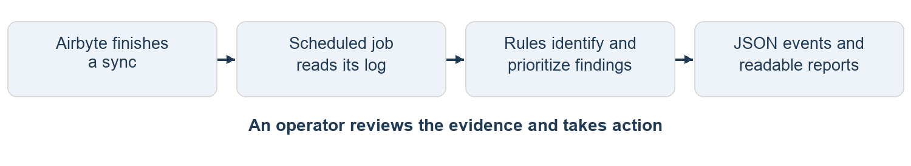
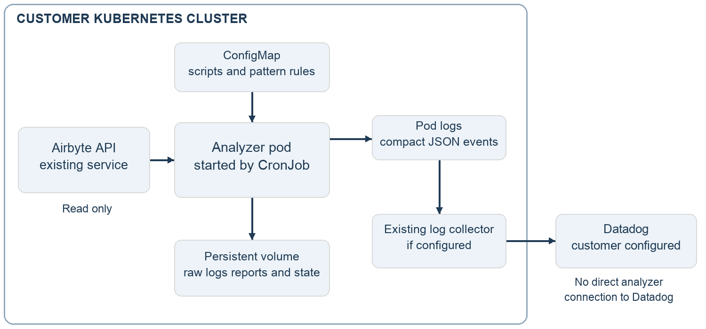

# Airbyte Sync Log Analyzer

What it does and how teams use it

A guide for platform owners, data operations teams, and anyone learning how the solution works. Based on the implemented release as of September 9, 2026.

The Airbyte Sync Log Analyzer turns connector sync logs into prioritized findings with explanations and recommended next steps. It gives an operator a consistent starting point for investigating failed or degraded data transfers, and produces structured output that an existing logging platform can use for searches and alerts.

### The problem it addresses

Airbyte moves data from source systems into a destination. A connector is the software that talks to a source; a sync is one run of that data transfer. Each run produces logs describing what happened. A failure notification tells an operator that attention is needed, but investigating the cause still requires reading those logs and deciding which messages matter.

Across many connections, this becomes repetitive. A single failure can produce several error lines, including platform cleanup messages that add noise. Some runs also show suspicious record counts without an obvious error. The analyzer organizes this evidence so the operator can focus on the next useful action.

| What the analyzer provides | Why it helps an operator |
| --- | --- |
| Error categories and severity | Separates authentication, rate-limit, memory, network, and other failure patterns; prioritizes attention. |
| Explanations and remediation guidance | Provides a repeatable starting point for diagnosis instead of requiring every operator to recognize the log signature. |
| Noise suppression and count checks | Counts platform noise separately and flags possible missing, skipped, or unwritten records when the logs provide enough evidence. |
| Compact events and detailed reports | Supports central log searches while retaining the evidence and remediation needed for investigation. |

The intended value is less repetitive triage and more consistent diagnosis. Time savings and production incident outcomes have not yet been measured. A pattern match is diagnostic guidance, not a guarantee that the root cause has been proven.

Engineers can also run the analyzer manually against downloaded logs or a copied Airbyte status message. Scheduled mode applies the same analysis automatically; an optional assistant skill supports interactive use.

### Current delivery state

The implementation, JSON output, deployment manifests, and documentation are complete for the approved scope. The test suite passes 35 synthetic tests. Customer deployment and Datadog collection verification remain rollout activities.

## How a sync becomes a diagnostic



### 1  A sync finishes

Airbyte completes a job and retains its log. The scheduled analyzer selects newly discovered failed or incomplete jobs by default. Successful jobs can be included through an optional setting so that count checks also examine healthy-looking runs.

### 2  A scheduled job reads the evidence

A Kubernetes CronJob starts the analyzer on a schedule, every 30 minutes by default. It reads the Airbyte API, which is the service interface for listing jobs and retrieving logs. These calls are read-only. The analyzer neither starts a sync nor changes Airbyte configuration.

### 3  The parser organizes the log

The parser is the log reader. It extracts available sync status and timing, connector information, source stream counts, destination write statistics, and error and warning messages. Missing information remains missing or unknown; the parser cannot reconstruct facts that the log does not contain.

### 4  Rules classify and prioritize findings

Messages are matched against a curated knowledge base: a file of known message patterns and guidance. A match supplies a category, severity, explanation, and remediation steps. Known platform noise is counted separately. Unmatched errors are kept as uncategorized for manual review. A batch of logs produces an aggregate report ordered by the most severe findings.

### 5  Checks add context and outputs are redacted

The analyzer checks available record counts for anomalies and adds up detected rate-limit waits. It then masks recognized secrets in report data. A formatter produces one compact JSON event per analyzed sync, while detailed Markdown and JSON artifacts are saved for investigation.

### 6  An operator investigates and acts

An operator reads the event or report, checks the underlying evidence, and applies an appropriate fix through the normal operating process. The next run can be inspected to assess the result. Repeated unknown errors can be added to a local pattern file after review.

Because this is scheduled polling, detection is not immediate. A job finishing just after a poll normally waits until a later poll, plus processing time. No analyzer process stays running between scheduled executions.

## A worked example of an authentication failure

This example uses a synthetic log from the test suite, with a generic connection label and illustrative job ID 42. It demonstrates the implemented behavior without using customer data.

### What Airbyte records

```
ERROR HTTP 401 Unauthorized: Bad credentials
ERROR Source process exited with non-zero exit code 1
Sync summary status: failed
```

The first message indicates that the source rejected the credentials. The second records the source process stopping. These become two findings for the same sync; the finding count is not the number of separate incidents.

### What the operator receives

The report identifies a high-severity permission finding with pattern ID auth-failure. Its guidance is to verify the credential, check its required permissions, and confirm the account still has access to the projects or repositories being read. The source exit is also retained as a finding.

The following is a selected-field excerpt of the generated JSON event, expanded across lines for readability. The emitted event is one physical line and also contains brief descriptions of both findings, sanity details, and suppressed-noise counts.

```
{
  "event": "airbyte.sync.triage",
  "connector": "example-source",
  "job_id": 42,
  "status": "failed",
  "worst_severity": "high",
  "finding_count": 2
}
```

### What happens next

If the cluster log collector sends this event to Datadog and an appropriate monitor is configured, the operator can receive an alert there. Otherwise, the event is still available in the analyzer pod logs and the full report is retained on the volume.

The operator checks whether the credential expired, lost a permission, or belongs to an account without the required access. After correcting the issue, the operator can run or inspect a subsequent sync through Airbyte. The analyzer recommends these checks; it does not rotate credentials or retry the sync automatically.

### Other examples of useful evidence

A rate-limited run may spend a substantial part of its duration waiting before retrying API requests. The analyzer adds up detected waits to help explain that delay. A run that reads and processes records but writes none can produce a count anomaly even if its parsed status says completed. These checks depend on the counts and messages present in the log.

## Where results appear and how to read them

JSON is structured text with named fields that software can query. Markdown is text formatted with readable headings and lists. The analyzer produces both formats; it does not add a results screen inside Airbyte.

| Output | What it contains | How it is used |
| --- | --- | --- |
| JSON event in pod logs | Status, severity, counts, brief finding descriptions, sanity details, and rate-limit wait. | Read with kubectl logs; search or alert in Datadog after collection and parsing are verified. |
| Files on persistent storage | Markdown triage report and enriched JSON containing full redacted messages. | Open the report for remediation. Use enriched JSON when full message detail or automated processing is needed. |
| Optional email | Markdown report when findings or sanity flags exist. | Available only when an SMTP mail relay is configured. It is not required for primary delivery. |

### The fields that matter most

| Field | Meaning and interpretation |
| --- | --- |
| status | Status parsed from the log, such as failed or completed. Unknown means status could not be determined. |
| worst_severity | Most severe error or warning finding. It is null when none exists and does not include sanity flags. |
| finding_count and findings | Number of actionable error and warning findings, with a brief description of every finding. Repeated occurrences remain represented. |
| sanity_flags and sanity_details | Count checks that need attention. Read these even if status is completed or worst_severity is null. |
| suppressed_noise_count | Known non-actionable platform messages counted separately from findings. |
| rate_limit_wait_s | Total detected wait in seconds. Zero means no wait was detected, not proof that throttling never occurred. |

Descriptions are masked before shortening to 240 characters. A summary_truncated flag identifies shortened descriptions. Unknown findings use a message excerpt; their full redacted messages remain in the enriched JSON. Markdown samples occurrences and truncates message excerpts, so it is not the lossless record.

A sync with zero findings still emits an event when its log is analyzed. No new logs to analyze means no JSON events on stdout, although operational diagnostics may still appear on stderr. The presence of an event alone is therefore not an alert condition.

## How it fits into the customer environment



Kubernetes manages containers in a cluster. A pod is the temporary execution unit it starts for the analyzer. A CronJob is the schedule that creates it. The scripts use Python’s standard library and run in a stock python:3.12-slim container. The deployment requires no custom application image or image-build pipeline unless the customer’s own process requires one.

A ConfigMap supplies the scripts and pattern knowledge base to the pod. A persistent volume is storage that remains after the pod finishes; it holds polling state, downloaded logs, and generated reports. Polling state records processed job IDs to avoid reprocessing them during normal subsequent polls.

### Who operates each part

| Role | Responsibility |
| --- | --- |
| Faros | Supplies the source, initial pattern knowledge base and guidance, deployment manifests, and documentation. |
| Customer platform team | Deploys through its own audited repository and pipeline; owns scheduling, access, storage, and workload operation. |
| Customer operations and observability teams | Verify collection, configure monitors, investigate and fix failures, and maintain local patterns and guidance. |

The automated analyzer reads the in-cluster Airbyte API and can optionally contact a configured SMTP relay. It calls no AI or large language model service and sends no data directly to Datadog. Datadog ingestion, when enabled, is handled by the customer’s existing logging infrastructure.

## Maintaining the knowledge base over time

Faros supplies an initial knowledge base of failure patterns and remediation guidance to get the team started. The customer owns maintaining and extending its local knowledge base as it encounters new failures and learns which fixes work in its environment. This ongoing work keeps the guidance useful as connectors, permissions, and operating procedures change.

### What the customer maintains

A pattern defines the log messages to recognize, their category and severity, a plain-language explanation, and recommended remediation steps. The customer can add patterns for previously unknown failures and refine guidance for familiar ones. Logs provide the evidence for these updates; the analyzer does not learn from logs or change its rules automatically.

The supplied synthetic logs illustrate behavior and support testing. For new local rules, the team should add sanitized or synthetic examples that reproduce the relevant messages without exposing credentials or customer data. Real production logs remain subject to the customer’s access and retention controls.

### How a new failure becomes reusable guidance

- Review an uncategorized finding and its supporting log evidence. Unmatched errors remain visible for investigation.

- Investigate the cause and verify the remediation. Record what an operator should check and which steps resolved the issue.

- Add a narrowly targeted recognition rule, category, severity, explanation, and remediation to the local knowledge base. Include a documentation link only when it is relevant and verified.

- Check the rule against a sanitized or synthetic failure example and unrelated messages to catch false matches. Review the rule order before deployment.

- Deploy the updated pattern file through the customer’s normal change process. Review later reports to confirm the rule classifies the intended failure and that the guidance remains accurate.

### How local customization is delivered

Customer rules live in scripts/error_patterns.local.json, an overlay file that extends the bundled knowledge base without editing it. Overlay rules take priority, and the first matching rule wins, so specific rules should precede broad ones. The deployment handoff explains how to include this file in the ConfigMap and apply the update. Pattern and guidance updates require no analyzer code changes.

The customer should name an owner for reviewing unknown findings and maintaining these rules, with the platform team deploying approved updates. If the parser never extracts a relevant message, adding a pattern alone will not fix that gap; it needs an analyzer change. The INFO-level limitation described below is one such example.

## How redaction works and what the tool can establish

### Redaction is a programmed rule set

Before report data is written or an event is printed, Python code replaces recognized secret values with ***REDACTED***. JSON is the output format; it is not what performs the masking. The event formatter reuses the report redactor and checks the final event before emission.

| What the rules look for | Examples |
| --- | --- |
| Credential field names and text labels | password, token, api_key, secret, authorization, and related names. |
| Authentication header patterns | Credentials following Bearer or Basic. |
| Recognizable token formats | Supported GitHub, GitLab, Slack, AWS access-key, sk-, and JWT patterns. |

For example, password=example123 becomes password=***REDACTED***. Masking happens before a description is shortened, so cutting a token cannot prevent the detector from recognizing its full original format.

These rules cover known credential patterns; they are not a general personal-data anonymizer and cannot guarantee recognition of every secret format. Names, email addresses, or unfamiliar credentials may remain. Downloaded raw logs on the volume currently bypass report redaction. The customer controls their access and retention.

### Diagnosis is based on log evidence

A match is a recognized signature with a recommended investigation path. Unknown errors remain available for review, and operators can add reviewed rules in a local overlay file. Overlay rules take priority over the bundled knowledge base; within the rules, the first match wins. Documentation links appear only where a verified, relevant link is available.

The parser collects errors and warnings according to their log-level labels. Some fatal messages written at INFO level can therefore be missed. Missing status or connector metadata can yield unknown status or a filename-based label. Zero findings does not prove that a sync is healthy.

Count checks compare numbers in the log. They do not validate individual records against source APIs, enforce schemas or primary-key rules, or block downstream consumption. Automated repair, sync triggering, and content-integrity guarantees are outside this tool’s scope.

Normal polling uses job IDs to avoid duplicates, but event delivery is not guaranteed across every interruption: fetch state is recorded before analysis and output finish, and empty logs are skipped. Consecutive-failure or recovery monitoring needs additional validation of event coverage, ordering, and connection identity.

## Putting the solution into operation

### The initial rollout

The customer platform team deploys the packaged source and manifests through its normal process, with the schedule initially paused for verification. It confirms the Airbyte address, namespace, storage, and access, then runs the read-only connectivity probe.

A manual CronJob run checks that logs are analyzed, JSON events appear, and reports persist on the volume. Another poll should produce no duplicate events for those jobs. The first poll may include a backlog of recent failures.

For Datadog, verify the analyzer pod’s own events and JSON field parsing. Configure monitors against status, finding severity, and sanity fields. The customer observability team owns this configuration.

### Settings that change the operating experience

| Setting | Default | Effect |
| --- | --- | --- |
| Schedule | Every 30 minutes | Controls polling cadence. Detection also depends on job completion and processing time. |
| TRIAGE_FETCH_ALL | 0 | Set to 1 to include all terminal jobs, including successes and cancellations. Needed for broader healthy-run coverage. |
| TRIAGE_STDOUT_REPORT | 0 | Set to 1 to also print marked Markdown reports when findings or sanity flags exist. JSON events still emit. |
| SMTP_HOST | Empty | Optional email remains disabled until a relay is configured. |

### What is verified and what remains to confirm

The delivered implementation passed 35 tests using synthetic logs and local HTTP stub servers covering Config API and Public API discovery. The tests include categorization, redaction, JSON emission, optional Markdown output, and normal deduplication. This is implementation evidence, not confirmation of production deployment or Datadog ingestion.

Deployment completion requires a successful customer validation run and confirmation that the analyzer’s events reach the logging platform. Dashboards and monitors remain customer configuration work.

### Reference material

This guide describes source revision a2c7111 as of September 9, 2026. DEPLOYMENT_GUIDE.md provides the customer handoff steps; docs/EVENT_REFERENCE.md describes the JSON fields. Use the included package source and run deployment commands from its root. Examples in this document are synthetic.
